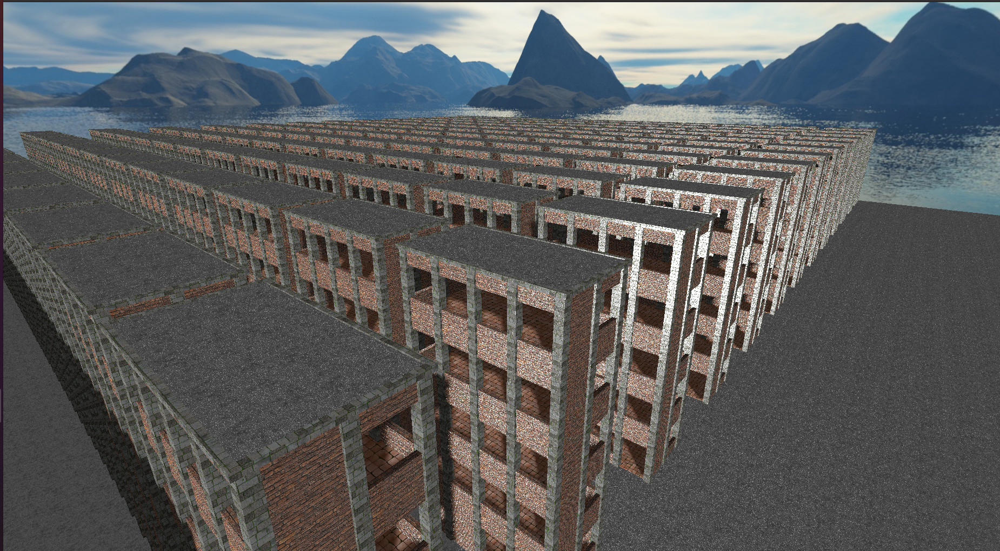

# render-bench

## Benchmark for Rend3/WGPU rendering.

John Nagle

Animats

nagle@animats.com

###Status - PRELIMINARY - 2022-04-28

### A load test for Rend3/WGPU scene updating from another thread.

This is intended to simulate a metaverse-type load, as with Second Life / Open Simulator,
where assets are constantly being added and deleted from the scene as the viewpoint moves.

There are two threads. One just refreshes the scene over and over.
The other adds a collection of buildings to the scene. 

Half the buildings are always present. The other half are inserted and
removed on a schedule:

* Add buildings.
* Wait 10 seconds.
* Delete buildings.
* Wait 10 seconds.

Repeat.

The buildings have a large number of individual meshes. At the moment,
textures are shared, but meshes and materials are not. 

### Results

On a Linux machine with an NVidia 3070, the scene displays at 60 FPS.
But while the other thread is adding buildings, that drops down to
13 to 25 FPS. This is the problem this program was built to demonstrate.
Mesh updates from other threads cause a severe impact on frame rate in
the refresh thread.

### Instructions

* Clone this repository.
* cargo build --release
* cd to target/release
* ./render-bench

A graphics window should appear, and you can watch the buildings appear and disappear.
The console shows frame rate and roughly what the program is doing.
WASD and QZ do what you'd expect. Click and look around with the mouse. 
ESC to get the mouse back for other purposes. There are some command line options
for setting graphics parameters, and --help will display them.

Tested on Linux, not yet tested on Windows or Mac, but it should work.

The program is prepped for profiling and should be buildable with option "tracy"
for use with Tracy.
